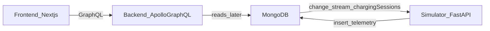

# EV Charging Station Demo App (S2DM)

## Overview

This repository contains the **application** part of an EV charging station demo used alongside a conceptual modeling effort.

- **Conceptual modeling repo**: [`COVESA/s2dm-example-charging-session-model`](https://github.com/COVESA/s2dm-example-charging-session-model)

Together, they serve as a baseline to explore the implications of using the **Vehicle Data Model (VDM)** as a conceptual and governance layer, and how that can influence **application design** and **database design** in practice.

The demo uses a simple EV charging station domain to illustrate an end-to-end workflow from conceptual modeling and versioning to the generation and application of artifacts in the physical layer. The goal is to show how logical/shared concepts can map to concrete implementations (APIs, schemas, formats) while keeping a common vocabulary.

## Prerequisites

### For Docker-based run

- Docker Desktop (with `docker compose` available)
- **Important**: The local MongoDB container starts as a single-node **Replica Set** (`rs0`) to support Change Streams (required by the Simulator).
  - If connecting from your host machine (e.g. Compass, scripts), use `directConnection=true` in your connection string: `mongodb://localhost:27017/charging_demo?replicaSet=rs0&directConnection=true`.

## Setup

Create an env file:

```bash
cp .env.example .env
```

You can edit `.env` to point to MongoDB Atlas or a different local MongoDB instance by changing `MONGODB_URI`.

## Run with Docker (recommended)

Build and start all services:

```bash
make build
```

Stop services:

```bash
make stop
```

Remove services + volumes:

```bash
make clean
```

### Endpoints (default)

- **Frontend**: `http://localhost:3000`
- **Backend GraphQL**: `http://localhost:4000/graphql`
- **Simulator**: `http://localhost:8000`
  - `GET /health`

## Architecture

The system is intentionally minimal and consists of:

- **Backend**: Node.js + Express + Apollo Server exposing a **schema-first GraphQL API**
- **Frontend**: Next.js (App Router) client consuming the GraphQL API
- **Simulator**: Python + FastAPI worker that listens to `chargingSessions` change streams and emits session telemetry into MongoDB
- **Database**: MongoDB (local container by default; Atlas-compatible via `MONGODB_URI`)
- **Orchestration**: Docker Compose



## Tech stack

- **Node.js**: 24+
- **TypeScript**: strict mode
- **Backend**: Express, Apollo Server, GraphQL Code Generator
- **Frontend**: Next.js (App Router), Apollo Client, GraphQL Code Generator
- **Simulator**: Python 3.12+, FastAPI, Uvicorn, Pydantic, PyMongo
- **Infra**: Docker, Docker Compose

## Folder structure

```
/
  backend/            # Node.js + Express + Apollo GraphQL API (schema-first)
  frontend/           # Next.js client consuming GraphQL
  simulator/          # FastAPI telemetry simulator
  docker-compose.yml  # Orchestration for local demo
  Makefile            # Convenience: make build/stop/clean
  .env.example        # Documented env vars (copy to .env)
  Agents.md           # Architecture & conventions for this repo
```

## Notes and troubleshooting

- **Schema-first GraphQL**: SDL in `backend/schema/schema.graphql` is the single source of truth. After changing it, re-run `npm run codegen`.
- **Docker credential helper issues**: if `docker compose` fails while pulling images with a credentials/keychain error, try fixing Docker Desktop login/credentials storage. As a workaround, you can also run compose with a temporary `DOCKER_CONFIG` that does not use a credential helper (advanced).

## License

See [`LICENSE`](LICENSE).
