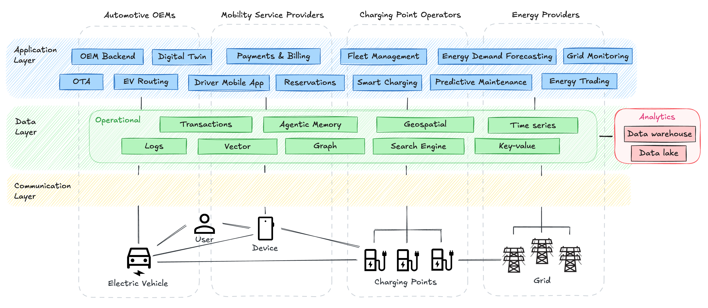
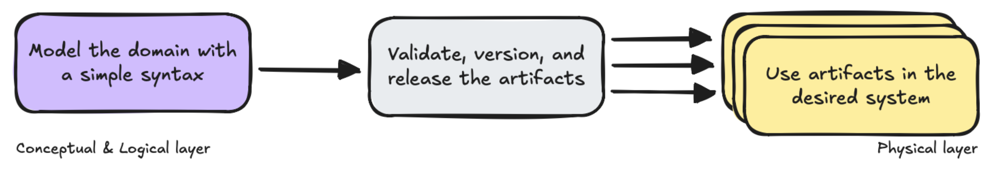
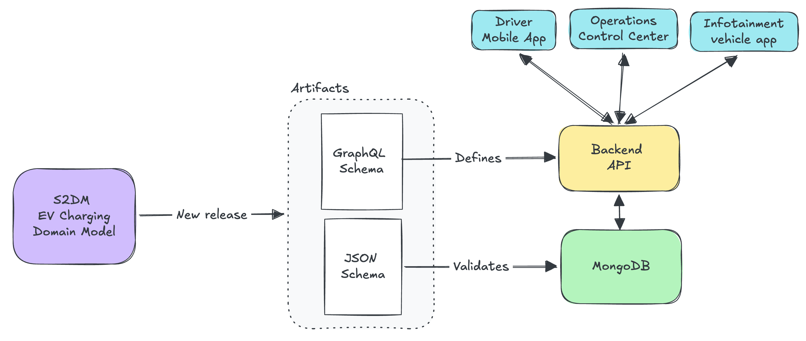
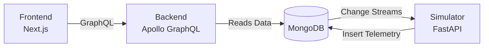

# S2DM EV Charging Demo App

Welcome to the **EV Charging Demo App**! This repository is the practical, **physical layer application** that demonstrates how we can bridge the gap in automotive data interoperability using the **Simplified Semantic Data Modeling (S2DM)** approach.

This project is part of a two-repository experiment. While this repository focuses on the concrete application implementation, it works hand-in-hand with our conceptual layer:

👉 **[Conceptual Modeling Repo](https://github.com/COVESA/s2dm-example-charging-session-model)**

Together, they illustrate how models derived from S2DM, such as the [Vehicle Data Model (VDM)](https://covesa.global/project/vehicle-data-model/), serve as a contract between data producers and consumers. They show how a model transitions from a descriptive, conceptual layer into prescriptive artifacts that influence physical layer systems like databases and APIs.

---

## From Models to Systems: The EV Charging Example

The EV charging ecosystem is a perfect example of this challenge. With many different actors—from vehicles and charging stations to mobility operators—needing to exchange data reliably, systems often define the same concepts in slightly different ways, creating interoperability gaps and fragile integrations.



S2DM solves this by bridging the conceptual and physical layers. A shared domain model is translated into **artifacts** that act as enforceable contracts across target systems.



### Seeing it in Action

This demo application illustrates with a practical example how a conceptual model governs the physical layer by using generated artifacts across the stack:



- **Storage Layer**: The conceptual model is translated into JSON Schema to enforce data validation rules in **MongoDB**. This provides a unified and flexible data foundation that adapts to changing requirements while maintaining control, allowing teams to enforce rules with varying validation levels.
- **Application Layer**: A **schema-first GraphQL API** defines the communication contract. This schema not only structures the API but also drives code generation for both backend and frontend type definitions, ensuring the application aligns perfectly with the model.

---

## Architecture

The system is intentionally minimal to focus on the concepts, consisting of four main components:

1. **Backend**: A Node.js + Express server exposing a **schema-first GraphQL API** (Apollo Server).
2. **Frontend**: A Next.js (App Router) client that consumes the GraphQL API to show charging station data.
3. **Simulator**: A Python + FastAPI worker that listens to MongoDB change streams (`chargingSessions`) and emits real-time telemetry back into the database.
4. **Database**: MongoDB (runs locally via Docker, configured as a single-node Replica Set to support change streams).



## Getting Started

Ready to see it in action? Follow these simple steps to spin up the entire ecosystem on your machine.

### Prerequisites

- **Docker Desktop** (with `docker compose` available).
- _Note on MongoDB_: The local container starts as a single-node **Replica Set** (`rs0`). If you want to connect a tool like MongoDB Compass to your local instance, use this connection string:
  `mongodb://localhost:27017/charging_demo?replicaSet=rs0&directConnection=true`

### 1. Setup Environment Variables

Copy the example environment file to set up your configuration:

```bash
cp .env.example .env
```

_(Optional: You can edit `.env` to point `MONGODB_URI` to an external MongoDB Atlas cluster if you prefer.)_

### 2. Run the Application (Docker)

We've provided a convenient Makefile to handle Docker orchestration. Build and start all services with one command:

```bash
make build
```

### 3. Explore the Endpoints

Once the containers are up and running, you can access the different parts of the system:

- **Frontend UI**: [http://localhost:3000](http://localhost:3000)
- **Backend GraphQL API**: [http://localhost:4000/graphql](http://localhost:4000/graphql)
- **Simulator Health Check**: [http://localhost:8000/health](http://localhost:8000/health)

### 4. Teardown

To stop the services without losing data:

```bash
make stop
```

To completely remove the services and clear the database volumes:

```bash
make clean
```

---

## Tech Stack

- **Node.js** (v24+) & **TypeScript** (strict mode)
- **Frontend**: Next.js (App Router), Apollo Client, GraphQL Code Generator
- **Backend**: Express, Apollo Server, GraphQL Code Generator
- **Simulator**: Python 3.12+, FastAPI, Uvicorn, Pydantic, PyMongo
- **Infrastructure**: Docker, Docker Compose
- **Database**: MongoDB

## Folder Structure

```text
/
├── backend/            # Node.js GraphQL API (schema-first)
├── frontend/           # Next.js client
├── simulator/          # Python telemetry simulator
├── docs/               # Project documentation
├── docker-compose.yml  # Orchestration for the local demo
├── Makefile            # Convenience commands (build/stop/clean)
└── .env.example        # Template for environment variables
```

## Troubleshooting & Notes

- **Schema-first GraphQL**: The SDL source files live under `backend/schema/governed` and `backend/schema/app`. If you modify them, remember to re-run `npm run codegen` in the respective folders to update the generated types.
- **Docker Credential Helper Issues**: If `docker compose` fails while pulling images with a keychain/credentials error, try resetting your Docker Desktop login credentials. Alternatively, run compose with a temporary `DOCKER_CONFIG` that bypasses the credential helper.

## License

This project is licensed under the terms of the [LICENSE](LICENSE) file.
